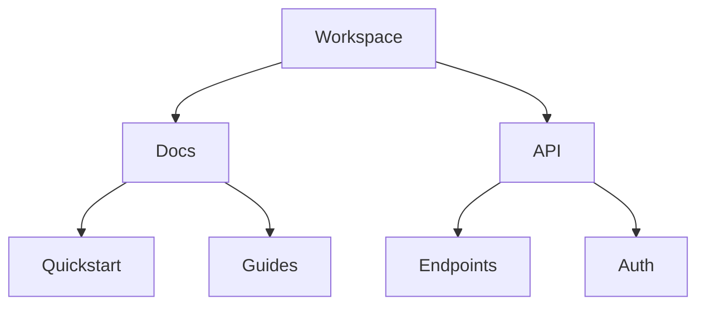

## Overview

Tables Guru provides powerful tools to organize, collaborate on, and customize your documentation spaces. You create structured workspaces with folders, enable real-time collaboration, search efficiently, and tailor spaces to your needs. These features help teams maintain organized knowledge bases.

<Callout kind="info">
  Start by creating a new space in your Tables Guru dashboard at `https://dashboard.tablesguru.com`.
</Callout>

## Document Structuring and Folders

Organize your documentation hierarchically using folders and subfolders. You nest pages deeply for complex projects, with drag-and-drop reordering.

<Columns cols={3}>
  <Card title="Nested Folders" icon="folder" href="#">
    Create unlimited nesting levels to mirror your project structure.
  </Card>
  <Card title="Bulk Operations" icon="layers" href="#">
    Move, rename, or delete multiple documents at once.
  </Card>
  <Card title="Page Templates" icon="file-text" href="#">
    Reuse templates for consistent documentation.
  </Card>
</Columns>

Visualize your structure:



## Collaboration and Version Control

Invite team members to collaborate in real-time. Changes track automatically with version history, allowing you to revert or compare versions.

<Steps>
  <Step title="Invite Collaborators" icon="users">
    Share your space link or add emails via the members panel.
  </Step>
  <Step title="Make Changes" icon="edit-3">
    Edit documents simultaneously—others see updates live.
  </Step>
  <Step title="View History" icon="git-branch">
    Access version history to restore previous states.
  </Step>
</Steps>

Compare versions programmatically:

<CodeGroup tabs="JavaScript,Python">
  ```javascript
  // Fetch version history
  const history = await fetch('https://api.tablesguru.com/spaces/{SPACE_ID}/history', {
    headers: { Authorization: `Bearer ${YOUR_API_KEY}` }
  });
  const versions = await history.json();
  console.log(versions);
  ```
  ```python
  import requests

  response = requests.get(
      'https://api.tablesguru.com/spaces/{SPACE_ID}/history',
      headers={'Authorization': f'Bearer {YOUR_API_KEY}'}
  )
  versions = response.json()
  print(versions)
  ```
</CodeGroup>

## Search and Filtering Tools

Find content quickly with full-text search, advanced filters, and saved queries. You search across spaces, filter by tags, authors, or dates.

<Tabs>
  <Tab title="Basic Search" icon="search">
    Enter keywords to find matching pages instantly.
    
    Example: Search for `authentication` returns all related docs.
  </Tab>
  <Tab title="Advanced Filters" icon="filter">
    Combine filters like `tag:api AND author:john date>2024-01-01`.
    
    <Callout kind="tip">
      Save frequent searches as bookmarks for quick access.
    </Callout>
  </Tab>
  <Tab title="Global Search" icon="globe">
    Search all your spaces from the top navigation bar.
  </Tab>
</Tabs>

## Customization Options

Tailor spaces with themes, permissions, and layouts. Set custom domains, adjust navigation, and integrate embeds.

<ExpandableGroup>
  <Expandable title="Theme Customization" default-open="true">
    Choose from predefined themes or use custom CSS.
    
    ```css
    :root {
      --brand-color: #3B82F6;
    }
    ```
  </Expandable>
  <Expandable title="Permission Levels">
    Define roles: Viewer, Editor, Admin with granular controls.
  </Expandable>
  <Expandable title="Integrations">
    Embed from GitHub, Slack, or custom webhooks at `https://your-webhook-url.com/webhook`.
  </Expandable>
</ExpandableGroup>

These features ensure Tables Guru scales with your team's needs. Explore [quickstart](/quickstart) for hands-on setup.